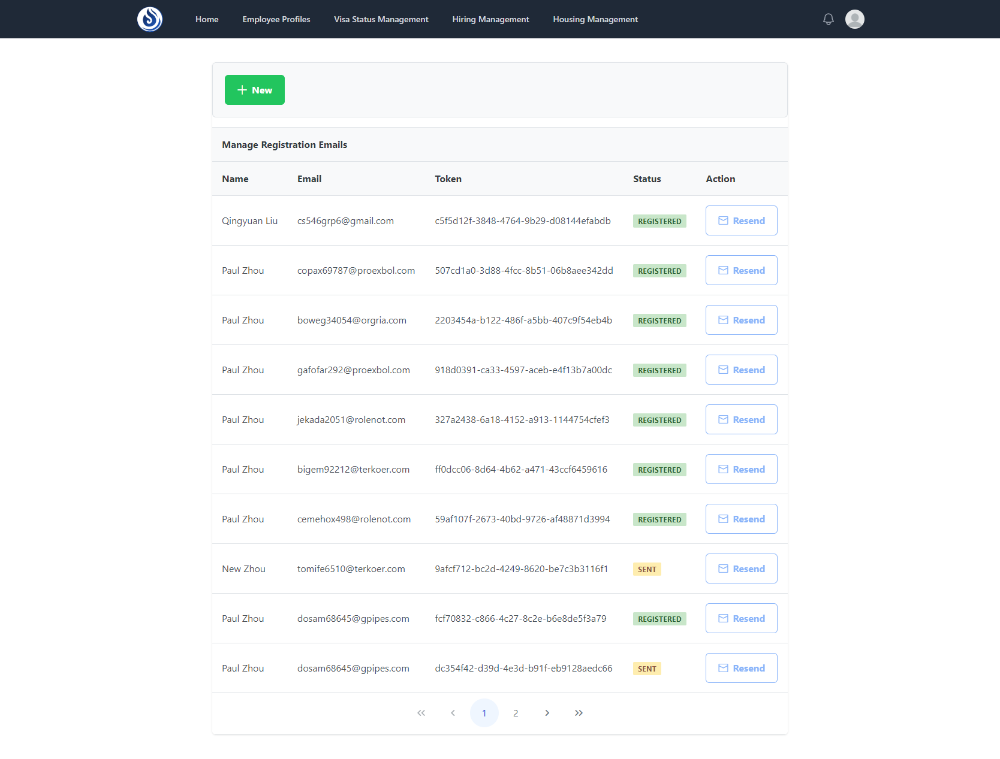
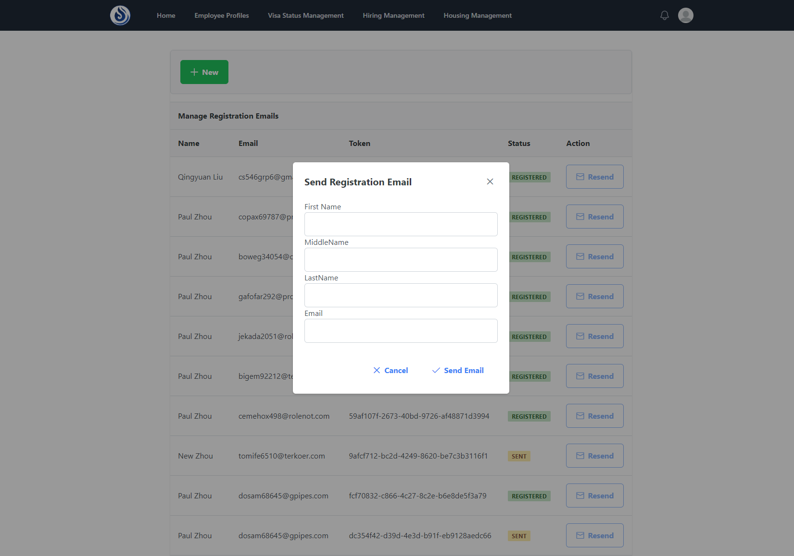
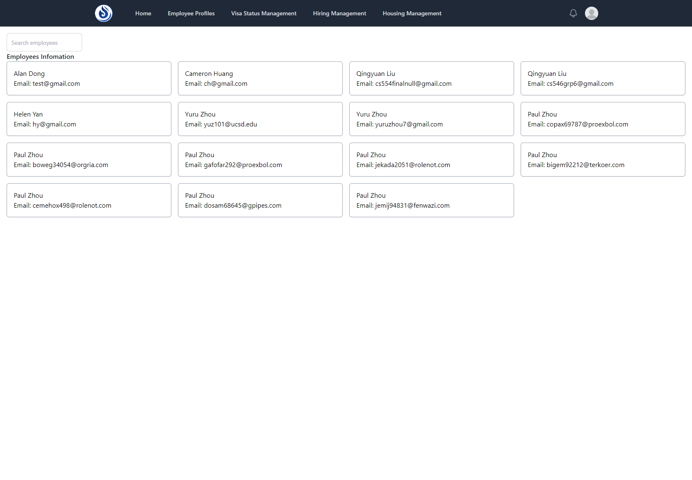
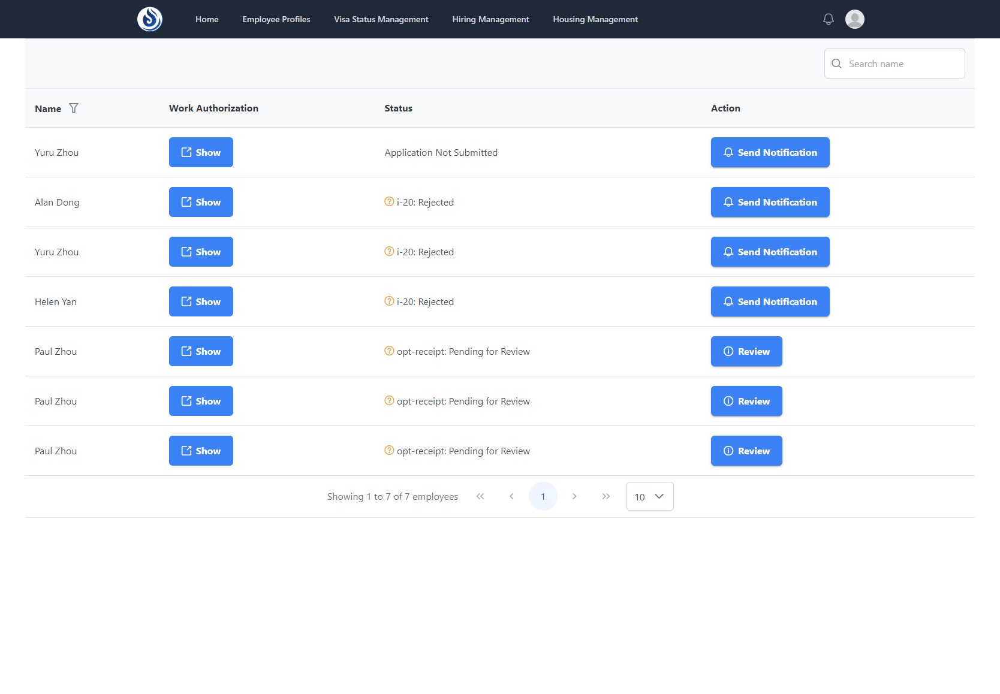
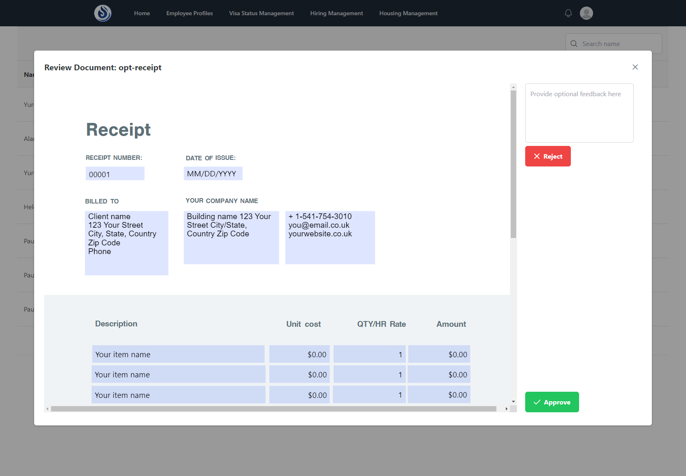
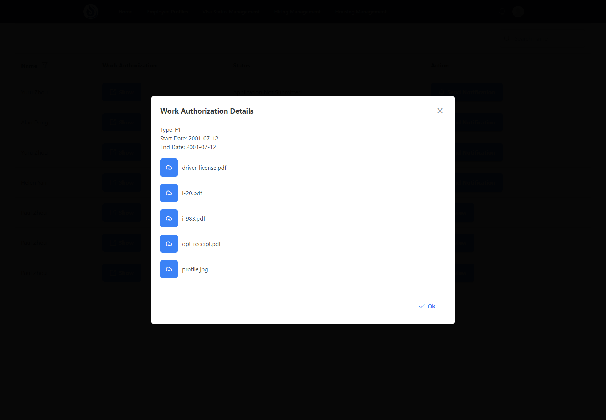
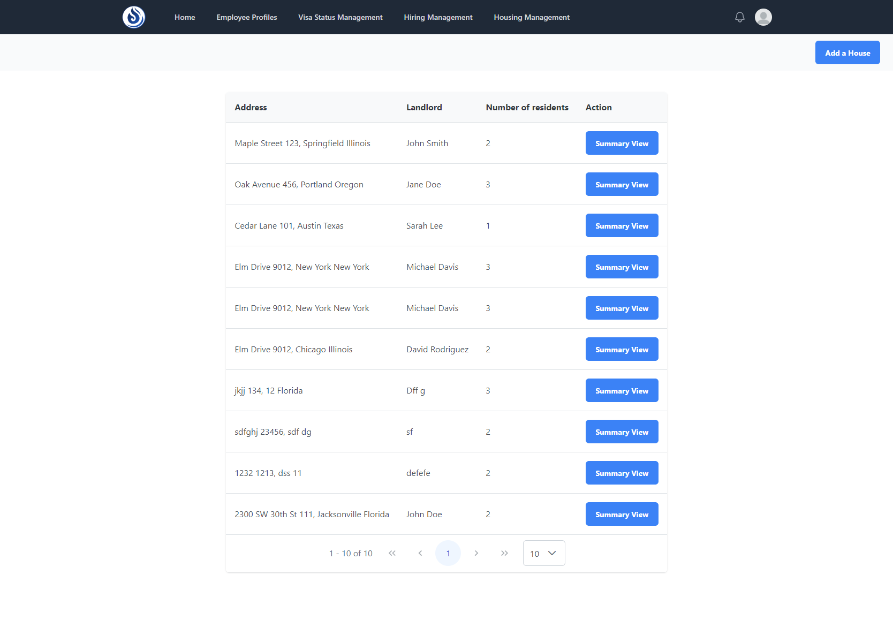
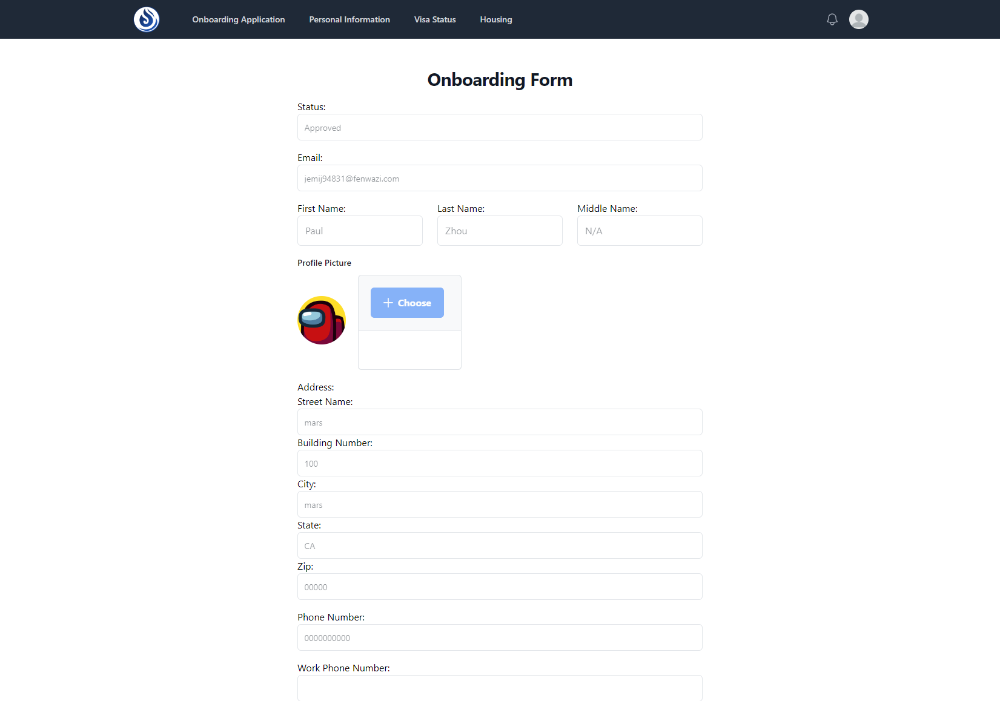
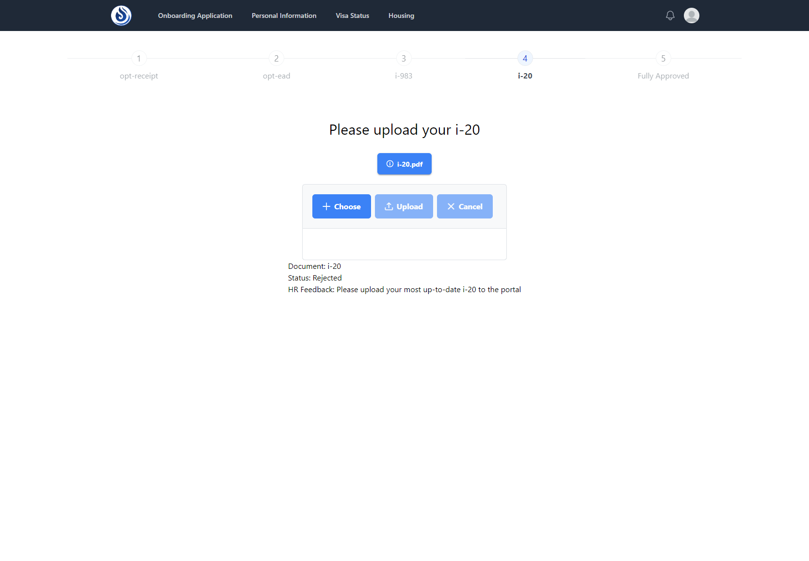
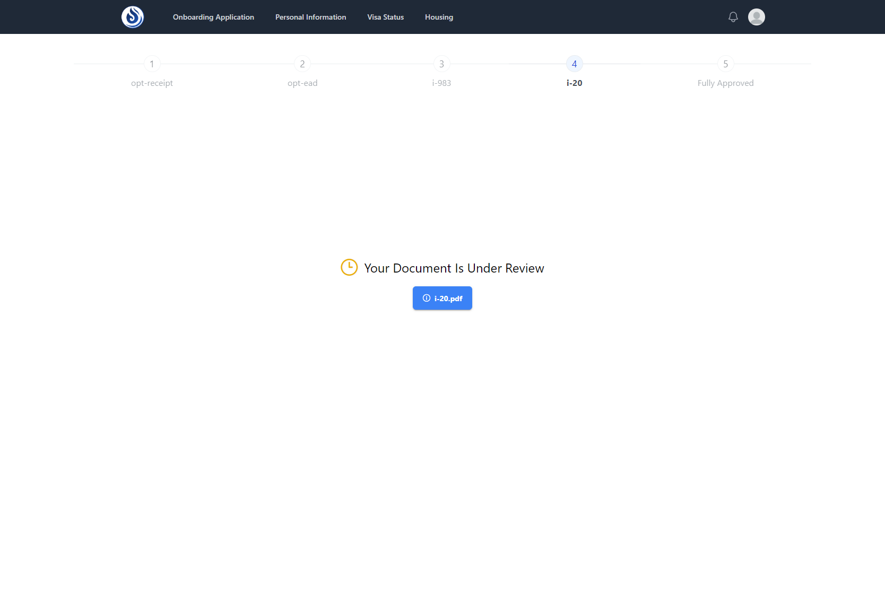

# Employee/HR Portal

## Overview

This project is a web-based platform designed to manage the new employee onboarding process, employee personal information, employee document submission/review, and more.

This project was developed using the following frameworks/libraries/platforms:
- Angular
- ngrx
- Node.js
- Express.js
- MongoDB
- AWS S3

In addition, the following libraries were used:
- PrimeNG
- Tailwind CSS
- Nodemailer
- Jsonwebtoken
- Bcryptjs
- ng2-pdf-viewer
- Express-validator
- Multer

## Screenshots

Here are some screenshots of the Employee/HR Portal:

